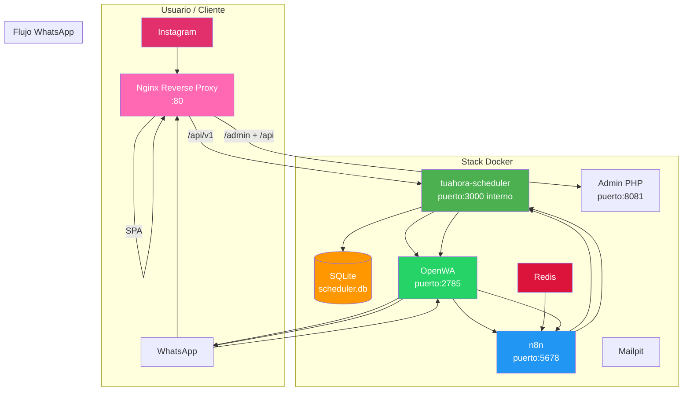

# Arquitectura del Sistema

> ✅ **Migración completada — EasyAppointments y MySQL retirados (15 Jun 2026).** El stack es ahora más liviano: Scheduler (Node + SQLite) reemplaza EA + MySQL.
> 🛠️ **18 Jun 2026 — Deploy fixes:** nginx ahora actúa como reverse proxy central para SPA + API + admin. Landing en `:80`.



## Nginx Reverse Proxy (:80)

El landing Nginx ahora funciona como **reverse proxy central**. Todo el tráfico entra por el puerto `:80` y se rutea según el path:

| Location | Destino | Propósito |
|---|---|---|
| `/api/v1` | `scheduler:3000` | API del motor de reservas (SPA + admin) |
| `/admin` | `landing-admin:8080` | Panel de administración PHP |
| `/api` | `landing-admin:8080` | API del admin (branding, uploads) |
| `/` | Nginx static | Landing SPA (`index.html`, assets) |

**IMPORTANTE:** `/api/v1` debe ir **antes** que `/api` en `nginx.conf`. Si se invierte el orden, `/api/v1` matchea `/api` y las requests van al admin PHP en vez del scheduler.

El SPA usa URLs relativas (`var API = '/api/v1'`) por lo que funciona en cualquier entorno sin hardcodear `localhost:3000`.

### Security headers

Nginx agrega headers de seguridad en todas las responses:
```
X-Content-Type-Options: nosniff
X-Frame-Options: DENY
Referrer-Policy: strict-origin-when-cross-origin
Permissions-Policy: camera=(), microphone=(), geolocation=()
```

## Flujo principal

1. Cliente llega a la **landing** (Nginx + vanilla JS SPA en `:80`) desde Instagram/WhatsApp
2. Ve servicios y reserva vía [[TuAhoraScheduler]] API. **Rutas públicas (sin auth):** `POST /customers`, `POST /appointments`, `GET /services`, `GET /availabilities`, `GET /slots` — proxeadas por nginx `/api/v1` → `scheduler:3000`.
3. **Rutas con API key:** `GET /customers`, `GET /appointments`, `GET /appointments/:id/cancel`, `POST /whatsapp/send` requieren `X-API-Key` header. Usadas por admin dashboard y n8n workflows.
4. Scheduler notifica a n8n vía webhook autenticado (`X-Webhook-Token` header) — confirmación en tiempo real (WF-RT)
5. WF-RT envía WhatsApp vía **scheduler como proxy**: n8n → `GET http://scheduler:3000/api/v1/whatsapp/send?phone=...&message=...` con `x-api-key` header → OpenWA → WhatsApp
6. WF-1 (polling cada 2 min) como backup de confirmación, mismo proxy con auth
7. 24h antes: WF-2 dispara recordatorio diario (21:00 ART) vía el mismo proxy WhatsApp
8. Cancelación/reagendado: cliente escribe por WhatsApp → OpenWA forward → n8n webhook (WF-3/WF-4) → Scheduler API + confirmación WhatsApp vía proxy
9. **Admin panel** (PHP en `:8081`) accesible vía nginx proxy (`/admin`) o directamente en `:8081`, con GD library para procesamiento de imágenes (logo + gallery)

## WhatsApp Proxy

El scheduler expone `GET/POST /api/v1/whatsapp/send` (requiere `X-API-Key` header) que proxyea a OpenWA (`http://openwa:2785/api/sendText`). Esto evita que n8n llame a OpenWA directamente, lo cual era problemático porque:
- El Code node de n8n bloquea `require('http')`
- El HTTP Request node v4.2 tiene un bug que ignora POST cuando hay query params

**Flujo WhatsApp:** n8n HTTP Request (GET con query params + `x-api-key: {{ $env.SCHEDULER_API_KEY }}`) → `scheduler:3000/api/v1/whatsapp/send` → `openwa:2785/api/sendText` → WhatsApp

### Auth en n8n → scheduler

Todos los HTTP Request nodes de n8n que llaman al scheduler (whatsapp/send, appointments CRUD) incluyen:
```
x-api-key: {{ $env.SCHEDULER_API_KEY }}
```

Los webhooks scheduler→n8n incluyen `X-Webhook-Token` header validado por los workflows.

### Errores genéricos en producción

El WhatsApp proxy devuelve errores genéricos (no stack traces) cuando `NODE_ENV=production`.

## Relacionado

- [[README|Volver al inicio]]
- [[DockerCompose]]
- [[TuAhoraScheduler]]
- [[OpenWA]]

## Admin Panel (PHP + GD)

El admin panel corre en un contenedor PHP con Apache en `:8081`. Su Dockerfile instala la librería GD (`libpng-dev libjpeg-dev`, configurado con `--with-gd --with-jpeg --with-png`) para permitir:
- **Upload de logo:** se renderiza en navbar (izquierda) y hero (centrado), max-width 200px. Guardado en `landing-salon/uploads/` y sincronizado a `landing/`.
- **Upload de gallery:** imágenes PNG y JPEG para la galería del landing.
- **Branding sync:** `admin/save-branding.php` escribe a `landing-salon/config.json` (admin) y `landing/config.json` (landing público, con `password` removido).
- **Services CRUD:** alta/baja/modificación de servicios vía scheduler API.
- **Appointments management:** ver/editar/eliminar turnos desde el dashboard.
- **Rate limiting:** usa `X-Real-IP` header (seteado por nginx) para limitar intentos de login por IP real del cliente.
- **Non-root:** contenedor corre como usuario `app` (Dockerfile `USER app`).

## Matriz de acceso — Scheduler API

| Endpoint | Método | Público | Requiere | Usado por |
|---|---|---|---|---|
| `/api/v1/services` | GET | ✅ | — | Landing SPA |
| `/api/v1/availabilities` | GET | ✅ | — | Landing SPA |
| `/api/v1/slots` | GET | ✅ | — | Landing SPA |
| `/api/v1/customers` | POST | ✅ | — | Landing SPA (crear cliente al reservar) |
| `/api/v1/appointments` | POST | ✅ | — | Landing SPA (crear turno) |
| `/api/v1/customers` | GET | ❌ | `X-API-Key` | Admin dashboard |
| `/api/v1/appointments` | GET | ❌ | `X-API-Key` | Admin dashboard, n8n workflows |
| `/api/v1/appointments/:id` | PUT/DELETE | ❌ | `X-API-Key` | Admin dashboard, n8n workflows |
| `/api/v1/appointments/:id/cancel` | GET | ❌ | `X-API-Key` | n8n workflows (WF-3, WF-4) |
| `/api/v1/whatsapp/send` | GET/POST | ❌ | `X-API-Key` | n8n workflows (todos los WFs outbound) |
| `/api/v1/health` | GET | ✅ | — | Monitoreo (mínimo, sin datos internos) |
