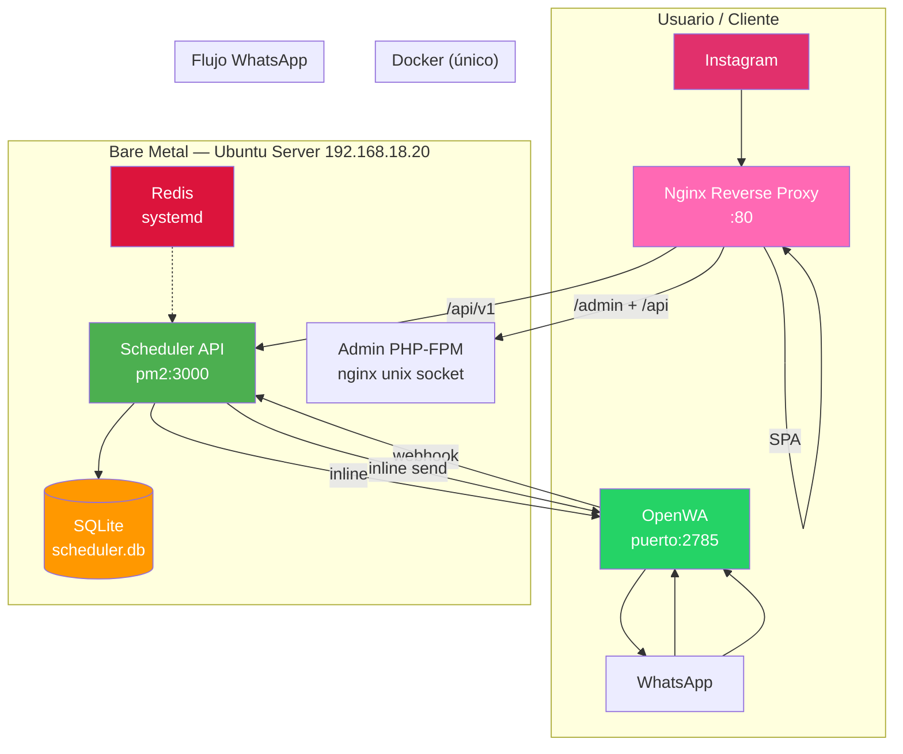

# Arquitectura del Sistema

> ✅ **Migración a bare metal completada (21 Jun 2026).** Stack migrado de Docker Compose (Windows/WSL2) a Ubuntu Server 24.04. Solo OpenWA corre en Docker (requiere Chromium isolation).



## Nginx Reverse Proxy (:80)

Nginx corre en bare metal como **reverse proxy central**. Todo el tráfico entra por el puerto `:80` y se rutea según el path:

| Location | Destino | Propósito |
|---|---|---|
| `/api/v1` | `localhost:3000` | API del motor de reservas (SPA + admin) |
| `/admin` | PHP-FPM socket | Panel de administración PHP |
| `/api` | PHP-FPM socket | API del admin (branding, uploads) |
| `/` | Nginx static | Landing SPA (`index.html`, assets) |

**IMPORTANTE:** `/api/v1` debe ir **antes** que `/api` en `nginx.conf`. Si se invierte el orden, `/api/v1` matchea `/api` y las requests van al admin PHP en vez del scheduler.

El SPA usa URLs relativas (`var API = '/api/v1'`) por lo que funciona en cualquier entorno sin hardcodear `localhost:3000`.

### Security headers

Nginx agrega headers de seguridad en todas las responses:
```
X-Content-Type-Options: nosniff
X-Frame-Options: DENY
Referrer-Policy: strict-origin-when-cross-origin
Permissions-Policy: camera=(), microphone=(), geolocation=()
```

## Flujo principal

1. Cliente llega a la **landing** (Nginx + vanilla JS SPA en `:80`) desde Instagram/WhatsApp
2. Ve servicios y reserva vía [[TuAhoraScheduler]] API. **Rutas públicas (sin auth):** `POST /customers`, `POST /appointments`, `GET /services`, `GET /availabilities`, `GET /slots`, `GET /health` — proxeadas por nginx `/api/v1` → `scheduler:3000`.
3. **Rutas con API key:** `GET /customers`, `GET /appointments`, `GET /appointments/:id/cancel`, `POST /whatsapp/send` requieren `X-API-Key` header. Usadas por admin dashboard.
4. Scheduler maneja **confirmación en tiempo real inline** (ya no vía n8n): cuando se crea un turno, el scheduler envía el WhatsApp directamente a OpenWA. Ver `appointments.js:120-153`.
5. Recordatorios, cancelaciones y reagendados vía webhooks de OpenWA → scheduler. El flujo WhatsApp está integrado directamente en el scheduler (no usa n8n).
6. **Admin panel** (PHP-FPM) accesible vía nginx proxy (`/admin`), con GD library para procesamiento de imágenes (logo + gallery).

## WhatsApp — Inline en scheduler

**n8n ya no corre.** La confirmación en tiempo real se maneja inline en el scheduler. Los flujos complejos (cancelación, reagendado, recordatorios) también se manejan desde el scheduler vía webhooks de OpenWA.

### Flujo inline de WhatsApp

1. Cliente reserva → `POST /appointments` → scheduler escribe en DB → scheduler llama a OpenWA directamente (`http://127.0.0.1:2785/api/sendText`) con la confirmación.
2. Cliente escribe "CANCELAR" → OpenWA envía webhook a `scheduler:3000/webhook/whatsapp` → scheduler procesa y cancela.
3. Scheduler expone `POST /api/v1/whatsapp/send` (requiere `X-API-Key` header) para uso por admin u otros servicios.

### OpenWA webhook payload

El handler del webhook WhatsApp lee el payload con fallback:
```javascript
const payload = req.body?.data || req.body || {};
```

Esto maneja tanto el formato anidado (`body.data.from`) como el plano (`body.from`).

## Servicios en el servidor

| Servicio | Gestión | Puerto | Logs |
|---|---|---|---|
| Nginx | systemd | :80 | `/var/log/nginx/` |
| PHP-FPM | systemd | socket | `/var/log/php8.5-fpm.log` |
| Scheduler | pm2 (fork) | :3000 | `/var/log/tuahora/scheduler-{error,out}.log` |
| OpenWA | Docker | :2785 | Docker logs |
| Redis | systemd | interno | `/var/log/redis/` |

## WhatsApp Proxy

El scheduler expone `POST /api/v1/whatsapp/send` (requiere `X-API-Key` header) que proxyea a OpenWA (`http://127.0.0.1:2785/api/sendText`).

### Auth

Todos los calls al scheduler (whatsapp/send, appointments CRUD) requieren:
```
x-api-key: {{ SCHEDULER_API_KEY }}
```

### Errores genéricos en producción

El WhatsApp proxy devuelve errores genéricos (no stack traces) cuando `NODE_ENV=production`.

## Admin Panel (PHP + GD)

El admin panel corre en PHP-FPM en bare metal. La librería GD está instalada en el sistema para:
- **Upload de logo:** se renderiza en navbar (izquierda) y hero (centrado), max-width 200px. Guardado en `landing-salon/uploads/` y sincronizado a `landing/`.
- **Upload de gallery:** imágenes PNG y JPEG para la galería del landing.
- **Branding sync:** `admin/save-branding.php` escribe a `landing-salon/config.json` (admin) y `landing/config.json` (landing público, con `password` removido). También sincroniza `address` y `profesional` con el scheduler vía `PUT /providers/5`.
- **Services CRUD:** alta/baja/modificación de servicios vía scheduler API.
- **Appointments management:** ver/editar/eliminar turnos desde el dashboard.
- **Rate limiting:** usa `X-Real-IP` header (seteado por nginx) para limitar intentos de login por IP real del cliente.
- **Non-root:** PHP-FPM corre como usuario `app`.

## Matriz de acceso — Scheduler API

| Endpoint | Método | Público | Requiere | Usado por |
|---|---|---|---|---|
| `/api/v1/services` | GET | ✅ | — | Landing SPA |
| `/api/v1/availabilities` | GET | ✅ | — | Landing SPA |
| `/api/v1/slots` | GET | ✅ | — | Landing SPA |
| `/api/v1/customers` | POST | ✅ | — | Landing SPA (crear cliente al reservar) |
| `/api/v1/appointments` | POST | ✅ | — | Landing SPA (crear turno) |
| `/api/v1/customers` | GET | ❌ | `X-API-Key` | Admin dashboard |
| `/api/v1/appointments` | GET | ❌ | `X-API-Key` | Admin dashboard |
| `/api/v1/appointments/:id` | PUT/DELETE | ❌ | `X-API-Key` | Admin dashboard |
| `/api/v1/appointments/:id/cancel` | GET | ❌ | `X-API-Key` | Admin dashboard, webhooks |
| `/api/v1/whatsapp/send` | POST | ❌ | `X-API-Key` | Admin, inline scheduler |
| `/api/v1/health` | GET | ✅ | — | Monitoreo (mínimo, sin datos internos) |

## Relacionado

- [[README|Volver al inicio]]
- [[TuAhoraScheduler]]
- [[OpenWA]]
- [[Sesion-2026-06-21]] — Migración a bare metal
- [[DockerCompose]] — Stack Docker histórico (solo OpenWA usa Docker actualmente)
