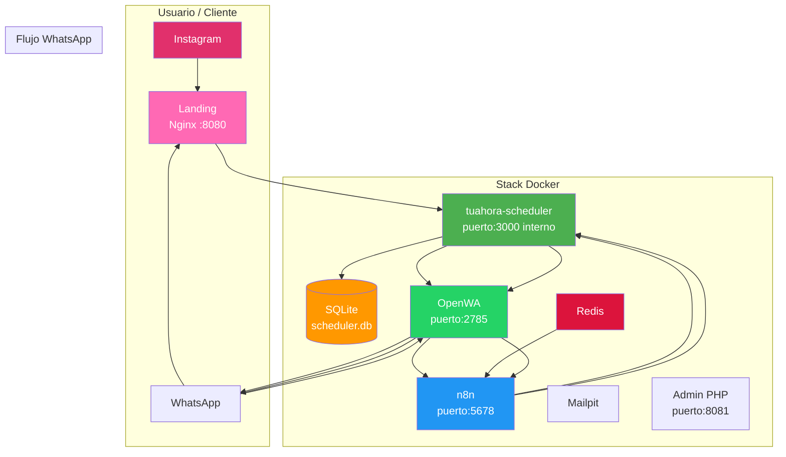

# Arquitectura del Sistema

> ✅ **Migración completada — EasyAppointments y MySQL retirados (15 Jun 2026).** El stack es ahora más liviano: Scheduler (Node + SQLite) reemplaza EA + MySQL.

## Flujo principal

1. Cliente llega a la **landing** (Nginx + vanilla JS SPA en `:8080`) desde Instagram/WhatsApp
2. Ve servicios y reserva vía [[TuAhoraScheduler]] API (`POST /appointments`, `POST /customers` — rutas públicas sin auth)
3. Scheduler notifica a n8n vía webhook (`/webhook/appointment-created`) — confirmación en tiempo real (WF-RT)
4. WF-RT envía WhatsApp vía **scheduler como proxy**: n8n → `GET http://scheduler:3000/api/v1/whatsapp/send?phone=...&message=...` → OpenWA → WhatsApp
5. WF-1 (polling cada 2 min) como backup de confirmación, mismo proxy
6. 24h antes: WF-2 dispara recordatorio diario (21:00 ART) vía el mismo proxy WhatsApp
7. Cancelación/reagendado: cliente escribe por WhatsApp → OpenWA forward → n8n webhook (WF-3/WF-4) → Scheduler API + confirmación WhatsApp vía proxy
8. **Admin panel** (PHP en `:8081`) separado como servicio independiente, con GD library para procesamiento de imágenes (logo + gallery)

## WhatsApp Proxy

El scheduler expone `GET/POST /api/v1/whatsapp/send` (handler inline antes de auth middleware, `app.all()`) que proxyea a OpenWA (`http://openwa:2785/api/sendText`). Esto evita que n8n llame a OpenWA directamente, lo cual era problemático porque:
- El Code node de n8n bloquea `require('http')`
- El HTTP Request node v4.2 tiene un bug que ignora POST cuando hay query params

**Flujo WhatsApp:** n8n HTTP Request (GET con query params) → `scheduler:3000/api/v1/whatsapp/send` → `openwa:2785/api/sendText` → WhatsApp

## Relacionado

- [[README|Volver al inicio]]
- [[DockerCompose]]
- [[TuAhoraScheduler]]
- [[OpenWA]]

## Admin Panel (PHP + GD)

El admin panel corre en un contenedor PHP con Apache en `:8081`. Su Dockerfile instala la librería GD (`libpng-dev libjpeg-dev`, configurado con `--with-gd --with-jpeg --with-png`) para permitir:
- **Upload de logo:** se renderiza en navbar (izquierda) y hero (centrado), max-width 200px. Guardado en `landing-salon/uploads/` y sincronizado a `landing/`.
- **Upload de gallery:** imágenes PNG y JPEG para la galería del landing.
- **Branding sync:** `admin/save-branding.php` escribe a `landing-salon/config.json` (admin) y `landing/config.json` (landing público, con `password` removido).
- **Services CRUD:** alta/baja/modificación de servicios vía scheduler API.
- **Appointments management:** ver/editar/eliminar turnos desde el dashboard.
- Credenciales: `admin` / `admin2024`.
